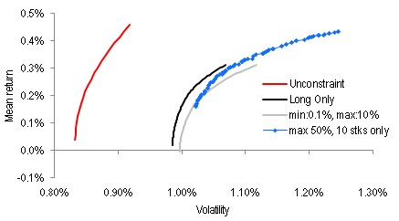

# Portfolio-Optimizer
Construct portfolios along mean-variance efficient frontier



This repository contains modules that can be used in generating portfolios a long the mean-variance efficient frontier.
List of modules:
 - [mQPSolve.bas](Modules/mQPSolve.bas) : A quadratic solver
 - [mPortOpt.bas](Modules/mPortOpt.bas) : Portfolio optimizers based on the quadratic solver
 - [cNSGA_II_Efficient_Frontier.cls](Modules/cNSGA_II_Efficient_Frontier.cls): Portfolio optimizers usign genetic algorithm
 - [mCovarEst.bas](Modules/mCovarEst.bas)

Example:
### Data
From [UCI Machine Learning Repositories](https://archive.ics.uci.edu/ml/datasets/Dow+Jones+Index)<sup>1</sup> we obtain weekly price change of 30 US-listed stocks from Jan-2011 to June-2011. So that's a 30 dimensional data with 24 weeks of observation. We will store that in an array *x(1:n_date, 1: n)*, where n_date=24 and n=30. We also have a vector *x_index(1:n_date)* to save the weekly return of Dow Jones Industrial Average index for the same period.  
1. Brown, M. S., Pelosi, M. & Dirska, H. (2013). Dynamic-radius Species-conserving Genetic Algorithm for 
the Financial Forecasting of Dow Jones Index Stocks. Machine Learning and Data Mining in Pattern 
Recognition, 7988, 27-41.

### Estimate the covariance matrix
Note that the number of observations is less than the number of stocks, so we cannot use sample covariance. The industry standard is to use factor mdoels like Barra to estimate the covariance matrix. But if you have access to Barra then you won't be reading this now on the internet, searching for a less expensive solution.
mCovarEst.bas currently has two methods implemented for this task
```
x_covar = mCovarEst.SingleIndex(x, x_index)
x_covar = mCovarEst.Ledoit(x)
```
.SingleIndex uses single index model for the estimation, which requires an input of a benchmark, which is why I had x_index() pulled out previously. Another way is to perform shrinkage estimate using .Lediot, which implements the method from [Ledoit and Wolf, 2003](http://www.ledoit.net/honey.pdf).  Either way *x_covar()* is a now a nxn matrix.

### Estimate the expected return
We will also need to estimate the expected return of each stock, which we just assume to be the geomtric average of historical return, and store it as a vector of size n , i.e. *x_mean(1:n)*.

### The actual optimization
Regardless of how you obtained the expected return and covaraince matrix, that's all the input you need now for the optimizer. Let's go through several scenarios which are plot in the figure above.

### Unconstraint
This is the simplest version without any constraints, which means you can hold either long or short positions at any value, as long as they sum to 1. The probelm can be solved exactly with Lagrange multiplier, and the syntax is:
```
Call mPortOpt.EF_Lagrange(x_mean, x_covar, EF_Curve, Port_Wgt, r_bin)
```
The mean and variance along the frontier will be saved to EF_Curve as an array of dimension r_bin x 2, where r_bin is the number of portfolios found along the frontier,  columns 1 & 2 are the mean and variance respectively. Port_Wgt() holds the portfolio weight of each portfolio on the frontier.

### Long-Only
If you are not allowed to hold short postions (i.e. weights have to be postive). A quadratic solver will need to be used, and the syntax is:
```
Call mPortOpt.EF_InteriorPt(x_mean, x_covar, EF_Curve, Port_Wgt)
```
If no additional argument is put in as above, then the first point discovered will be the minimum varaince portfolio (MVP). Subsequent portfolios are then generated with higer returns than MVP.

### Long-Only with constraints on minimum/maximum weight
No short position allowed and weight of any single stock cannot be lower/higher than a minimum/maximum value. This is the syntax for a 1% minimum and 20% maximum holding value.
```
Call mPortOpt.EF_InteriorPt(x_mean, x_covar, EF_Curve, Port_Wgt, 0.2, 0.001)
```
Only one or both of the min/max constraint can be input. Note that no-short constraint is always enforced and does not need to be reiterate in the minimum argument.

### Long-Only with constraints on number of stocks held
There are cases that you dont' want to own all the 30 stocks in the universe. In that case genetic algroithm can be used for optimzation. The method implemented here is Non-Dominated Sort Genetic Algorithm (NSGA-II). And below syntax shows the case of holding only 10 stocks.
```
    Dim GA1 As New cNSGA_II_Efficient_Frontier
    With GA1
        Call .Init(2, 100, 10)
        Call .Read_Global(x_mean, x_covar, 0, 0.5)
        Call .Evolve(8, 0.8, 0.1, 10000)
        EF_Curve = .EF_Curve
        Port_Wgt = .Portfolio_Wgts
        Call .Reset
    End With
    Set GA1 = Nothing
```
There a several parameters to be tuned.
.Init(m,n,k) : m is the number of objectives, which has to be 2 in this case. n is the population size, chosen to be 100 here.
k is the number of stocks you want to include in your portfolio
.Read_Global(x_mean, x_covar, min_wgt, max_wgt): x_mean() & x_covar() are the mean and covariance matrix found from the above sections. min_wgt and max_wgt are the minimum/maximum weight to allow any single stock to has, which is set to 0% and 50% here.
.Evolve(tournament_size, crossover_rate, mutation_rate, number_of_iterations): these are the usual parameters for any evolutionary algorithm.
The output can then be extracted with .EF_Curve and .Portfolio_Wgts
